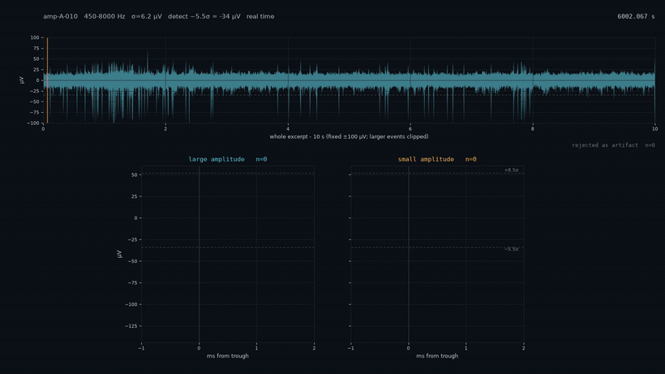
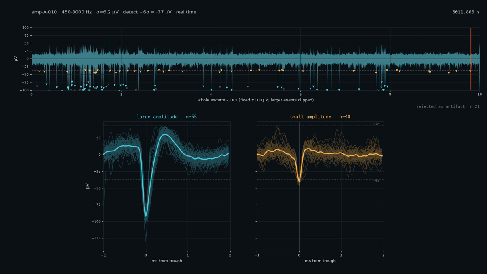
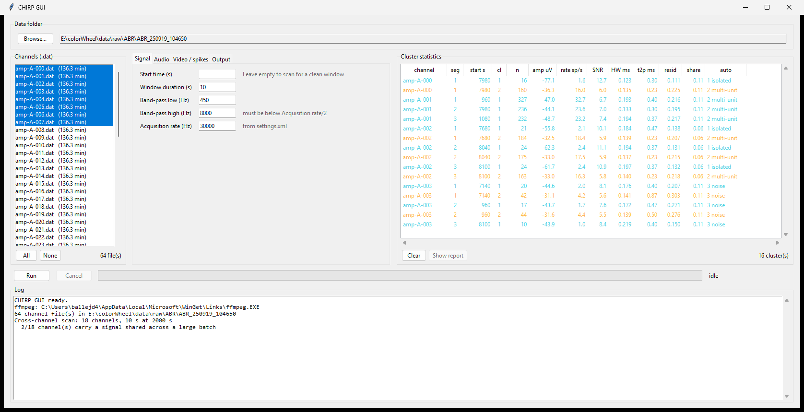

# CHIRP

**C**lustered **H**igh-frequency **I**ntan **R**ecording **P**layer

Turn raw Intan RHD `.dat` recordings into clips you can watch and listen to:
band-passed extracts from raw data, into audio and videos with the spike
waveforms accumulating as they appear, pre-clustered and coloured by amplitude.

Spikes played through a speaker chirp.

## Demo

[](demo/amp-A-013_10s_450-8000Hz.mp4)

**[Watch the clip with sound](demo/amp-A-013_10s_450-8000Hz.mp4)**
One channel, 450 to 8000 Hz, 10 s in real time, two amplitude clusters. The
preview above is silent and runs at double speed. The clip plays in real time,
with spikes appearing exactly as you hear them.



*Top: the whole window at a fixed voltage scale, with detected troughs marked
as the playhead passes them. Bottom: one narrow pane per amplitude cluster,
waveforms overlaid and accumulating, aligned on the trough, plus the running
mean in bold.*

## The GUI



---

## What it does

- Reads Intan's **"one file per channel"** recordings (`amp-<port>-<chan>.dat`):
  headerless `int16` little-endian, 0.195 µV/bit. It seeks straight to the
  requested byte offset.
- **Zero-phase band-pass** (Butterworth, `sosfiltfilt`), padded on both sides
  and trimmed afterwards, no filter edge transients.
- **WAV export** at the acquisition rate or resampled, 16-bit PCM or 32-bit
  float, volume normalised against a high percentile, not the raw peak.
- **Spike detection**: negative crossings of a user defined multiple of sigma
  (−kσ), where σ = MAD/0.6745 (Quiroga et al. 2004), taken at the trough with
  an adjustable refractory period.
- **Artifact rejection**: events whose waveform reaches +qσ are discarded.
- **Amplitude clustering**: 1-D k-means over trough amplitudes, trying 1 to 3
  clusters and keeping the largest count whose split holds up. Every cluster
  must be populated, and every adjacent pair of centres must be separated by at
  least a configurable multiple of their summed spread. Otherwise it falls back
  to a single group. Very simple but sufficient clustering.
- **Clean-window search**: scans the whole recording for the excerpt with the
  fewest artifacts and the clearest cluster split. Two-hour recordings are
  scanned in about 6 seconds.
- **MP4 rendering** with audio muxed in. Frames and audio are generated from
  the same filtered array in one pass. No drift.
- **Cluster statistics** (optional): spike count, mean trough amplitude,
  firing rate in sp/s, SNR (|mean trough| / σ), spike half-width and
  trough-to-peak latency. Computed over the best three non-overlapping windows
  per channel, not only the one that gets rendered. Written to
  `chirp_cluster_stats.csv` and shown in the GUI table as the run progresses,
  with a summary report at the end.

> Half-width and trough-to-peak shift with the band-pass, so compare them only
> between recordings filtered the same way.

## Requirements

- Python 3.10+
- `numpy`, `scipy`, `matplotlib` (`pip install -r requirements.txt`)
- `tkinter` for the GUI, bundled with python.org and most distributions
  (on Debian/Ubuntu: `sudo apt install python3-tk`)
- **ffmpeg** on `PATH`, for MP4 output only.

## Quick start

```bash
git clone https://github.com/JesusJBallesteros/CHIRP.git
cd CHIRP
pip install -r requirements.txt
```

### With the GUI

```bash
python chirp/intan_gui.py
```

Browse to a recording folder, select the channels, set the parameters, press
**Run**. Work happens on a background thread, so the window stays responsive
and **Cancel** interrupts a long render.

The four parameter tabs are:

| Tab | Controls |
|---|---|
| Signal | start time, window duration, band-pass corners, acquisition rate |
| Audio | resampling, bit depth, headroom |
| Video / spikes | frame rate, detection and rejection thresholds, voltage scale, frame size, slow motion, quality, pane width, artifact scan threshold, maximum clusters |
| Output | output folder, file name pattern, which outputs to write, ffmpeg location |

Leave **Start time** empty to have each channel scanned for a clean window.
The **Cluster statistics** table on the right fills in as each channel is
analysed, one row per channel, segment and cluster, coloured to match the
cluster panes in the video. A report window opens when the run finishes and can
be reopened with **Show report**.

### Without the GUI

Scripts look for `amp-*.dat` in the **current directory** unless you pass
`--folder`.

```bash
# 20 s from the middle of one channel, band-passed, as a WAV
python chirp/dat_to_audio.py --folder /path/to/recording amp-A-010.dat

# every channel in the current folder, 10 s each
cd /path/to/recording
python /path/to/CHIRP/chirp/dat_to_audio.py --all --duration 10

# spike video; omit --start and it finds a clean window for you
python chirp/dat_to_video.py --folder /path/to/recording amp-A-010.dat --duration 10

# keep spikes with a large positive rebound, and slow everything down 4x
python chirp/dat_to_video.py amp-A-010.dat --pos-k 12 --slow 4
```

`--help` on either script lists every option.

#### Some options

| Option | Meaning |
|---|---|
| `--folder` | where the `.dat` files live (default: current directory) |
| `--band LOW HIGH` | band-pass corners in Hz |
| `--duration` / `--start` | excerpt length and offset; blank start = auto |
| `--neg-k` / `--pos-k` | detection and artifact-rejection thresholds, in σ |
| `--artifact-k` | σ above which the clean-window scan calls a window dirty (default 18) |
| `--max-clusters` | most amplitude clusters to consider, 1 to 3 (default 3) |
| `--window` / `--slow` | detail pane width in ms; slow-motion factor |
| `--wave-width` | width of each cluster pane, as a fraction of the frame |
| `--resample` / `--bit-depth` | WAV output rate and depth |
| `--fs` | acquisition rate, if not 30 kHz (check `settings.xml`) |

> **On `--pos-k`.** Rejecting anything that crosses +kσ removes real artifacts,
> but on a healthy channel it also discards ordinary large spikes whose
> positive rebound happens to be big. If your artifacts are hundreds of µV
> while your spikes are tens, a higher `--pos-k` rejects the former without
> touching the latter. Check the accepted and rejected counts it prints.

## Cluster statistics

With **Cluster statistics** ticked, each selected channel is analysed over its
three best non-overlapping windows and one row is written per channel, segment
and cluster to `chirp_cluster_stats.csv` in the output folder.

| Column | Meaning |
|---|---|
| `channel` | source `.dat` file stem |
| `segment` | which ranked window, 1 being the best and the one rendered |
| `start_s`, `duration_s` | position and length of that window |
| `cluster`, `n_clusters` | cluster index (1 = largest amplitude) and how many were found |
| `n_spikes` | accepted spikes in this cluster |
| `mean_amplitude_uV`, `amplitude_sd_uV` | trough amplitude, mean and spread |
| `firing_rate_sp_s` | spikes per second |
| `snr` | \|mean trough\| / σ |
| `half_width_ms` | trough width at half its depth |
| `trough_to_peak_ms` | trough to the following positive maximum |
| `peak_uV` | positive maximum of the mean waveform |
| `sigma_uV` | noise estimate for that window, MAD/0.6745 |
| `n_rejected` | events discarded as artifacts in that window |
| `wf_residual` | how tightly the spikes superimpose on their own mean |
| `share_count`, `share_frac` | channels co-active with this one, count and fraction |
| `auto_quality` | first-pass tag, 1 to 3, or 0 if not assessed |

The final report totals the channels and segments analysed, the distribution of
cluster counts, the mean and standard deviation of each metric, and the
first-pass tag counts per cluster and per channel.

### First-pass quality tag

With two or more channels selected, each cluster gets an `auto_quality` value
meant as a quick screen before you look at anything yourself.

| Tag | Meaning |
|---|---|
| 1 | tight, repeatable waveform, likely one isolated unit |
| 2 | real activity, but not separable into a single unit |
| 3 | noise, or a signal shared across a large batch of channels |
| 0 | not assessed, too few spikes in the cluster to judge |

Three measurements feed it, none of which need a probe map.

**Sharing.** For each spike on a channel, how many channels in the session have
a spike within 1 ms, taken as a median and reported as `share_count`. A unit
picked up by a few neighbouring sites scores low and is left alone. A waveform
present across a large batch of channels scores high and is called noise. The
test fires above `max(8, 0.20 × channels)`, so on small probes, where a shared
unit cannot be told from a shared artifact, it never fires at all.

**Waveform residual.** RMS deviation of a cluster's spikes about their own mean,
divided by the mean trough depth, reported as `wf_residual`. This is the
overlay pane as a number. At or below 0.15 reads as one unit.

**Firing rate.** Above 10 sp/s, a cluster that is not tight enough to be one
unit is treated as busy multi-unit activity rather than an empty channel.

The order matters: sharing is tested first, because a common-mode waveform is
highly repeatable and would otherwise score as a textbook single unit.

Thresholds live at the top of `dat_to_video.py` as `SHARE_FRAC`,
`SHARE_MIN_CHANNELS`, `RESID_ISOLATED` and `RATE_MULTIUNIT`. They were fitted
on one hand-tagged 64-channel session, where the tag agreed with the human on
95% of channels and 91% of clusters and never called noise signal. The
waveform residual moves with the band-pass and the spike window, so check the
defaults against your own data before trusting them on a new preparation.

## Building the standalone Windows executable

The GUI can be packaged into a single `.exe`.

```bash
pip install pyinstaller
python chirp/build_exe.py
```

The result appears in `chirp/dist/`. Options:

| Command | Result |
|---|---|
| `python chirp/build_exe.py` | one `.exe`, ffmpeg bundled if found on `PATH` |
| `... --onedir` | unpack on a permanent folder instead of a temporal one, faster start-up |
| `... --no-ffmpeg` | lighter executable; needs ffmpeg on `PATH` |
| `... --ffmpeg C:\path\ffmpeg.exe` | bundle a specific ffmpeg build |
| `... --console` | keep a console window, for debugging |

An `.exe` file is **not** committed. Either build it yourself with the above,
or download it from the [Releases](https://github.com/JesusJBallesteros/CHIRP/releases)
page. The release build ships **without** ffmpeg, because of licencing reasons.

The downloaded `.exe` exports WAV out of the box, but needs ffmpeg installed
for MP4. Building locally bundles whichever ffmpeg you already have.

Notes on the executable:

- **Size.** ~217 MB: ffmpeg alone is 211 MB plus numpy, scipy and matplotlib.
  The project's code is a few tens of kB.
- **Startup.** A one-file build unpacks on each launch, so the application
  takes ~14 s to start up. `--onedir` avoids this.
- **Antivirus.** Unsigned PyInstaller executables sometimes trip heuristic
  scanners. Building locally avoids the issue.
- **Platform.** Windows x64. Run `build_exe.py` on macOS or Linux to get a
  binary for those.
- **ffmpeg licensing.** ffmpeg is not redistributed in this repository. If you
  distribute a build with ffmpeg bundled, mind the licence of the ffmpeg build
  you used.

## Repository layout

```
CHIRP/
├── chirp/
│   ├── dat_to_audio.py    reading, filtering, WAV export  (importable engine)
│   ├── dat_to_video.py    detection, clustering, statistics, MP4 rendering
│   ├── intan_gui.py       tkinter front end
│   └── build_exe.py       PyInstaller packaging
├── demo/                  demo video
├── docs/                  screenshots used by this README
└── .github/workflows/     release build for the Windows .exe
```

`dat_to_video.py` imports its DSP from `dat_to_audio.py`, so the filtering and
scaling are defined once and both paths stay consistent.

## Data format

Verified against INTAN's `settings.xml` and `info.rhd` metadata of the
recordings this was written for. If your acquisition rate differs, pass `--fs`.
Tested on "one file per channel" layout.

## Licence

MIT, see [LICENSE](LICENSE).
