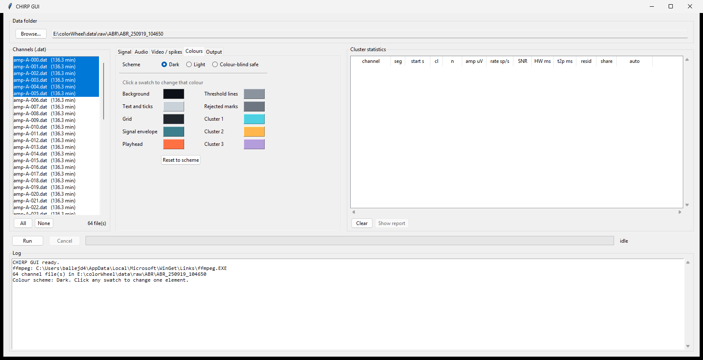

# CHIRP

**C**lustered **H**igh-frequency **I**ntan **R**ecording **P**layer

Size up an Intan recording session before committing it to a spike sorter.
CHIRP reads the raw `.dat` files, detects spikes, splits them by amplitude,
and reports per-cluster statistics with a first-pass tag separating isolated
units from multi-unit activity and from noise. The numbers it produces are
meant to be read before choosing parameters for a full sorter such as
Kilosort, and are described in [Before a spike sorter](#before-a-spike-sorter).

It also renders the same excerpt as audio and as video, with the spike
waveforms accumulating as you hear them, which makes a session audible and
watchable rather than only tabulated.

Spikes played through a speaker chirp.

## Demo

[](demo/amp-A-013_10s_450-8000Hz.mp4)

**[Watch the clip with sound](demo/amp-A-013_10s_450-8000Hz.mp4)**
One channel, 450 to 8000 Hz, 10 s in real time, two amplitude clusters. The
preview above is silent and runs at double speed. The clip plays in real time,
with spikes appearing exactly as you hear them.


*Top: the whole window at a fixed voltage scale, with detected troughs marked
as the playhead passes them. Bottom: one narrow pane per amplitude cluster,
waveforms overlaid and accumulating, aligned on the trough, plus the running
mean in bold.*

## The GUI


---

## What it does

- Reads Intan's **"one file per channel"** recordings (`amp-<port>-<chan>.dat`):
  headerless `int16` little-endian, 0.195 µV/bit. It seeks straight to the
  requested byte offset.
- **Zero-phase band-pass** (Butterworth, `sosfiltfilt`), padded on both sides
  and trimmed afterwards, no filter edge transients.
- **WAV export** at the acquisition rate or resampled, 16-bit PCM or 32-bit
  float, volume normalised against a high percentile, not the raw peak.
- **Spike detection**: negative crossings of a user defined multiple of sigma
  (−kσ), where σ = MAD/0.6745 (Quiroga et al. 2004), taken at the trough with
  an adjustable refractory period.
- **Artifact rejection**: events whose waveform reaches +qσ are discarded.
- **Amplitude clustering**: 1-D k-means over trough amplitudes, trying 1 to 3
  clusters and keeping the largest count whose split holds up. Every cluster
  must be populated, and every adjacent pair of centres must be separated by at
  least a configurable multiple of their summed spread. Otherwise it falls back
  to a single group. Very simple but sufficient clustering.
- **Clean-window search**: scans the whole recording for the excerpt with the
  fewest artifacts and the clearest cluster split. Two-hour recordings are
  scanned in about 6 seconds.
- **MP4 rendering** with audio muxed in. Frames and audio are generated from
  the same filtered array in one pass. No drift.
- **Cluster statistics** (optional): spike count, mean trough amplitude,
  firing rate in sp/s, SNR (|mean trough| / σ), spike half-width and
  trough-to-peak latency. Computed over the best three non-overlapping windows
  per channel, not only the one that gets rendered. Written to
  `chirp_cluster_stats.csv` and shown in the GUI table as the run progresses,
  with a summary report at the end.

> Half-width and trough-to-peak shift with the band-pass, so compare them only
> between recordings filtered the same way.

### What it is not

The clustering is 1-D, on trough amplitude, within one channel. It does no
template matching, uses no probe geometry, does not follow a unit across
channels, and does not correct for drift. Two units of similar amplitude on
the same channel will land in one cluster. Use it to decide whether a session
is worth sorting and with what settings, not as the sorting itself.

## Requirements

- Python 3.10+
- `numpy`, `scipy`, `matplotlib` (`pip install -r requirements.txt`)
- `tkinter` for the GUI, bundled with python.org and most distributions
  (on Debian/Ubuntu: `sudo apt install python3-tk`)
- **ffmpeg** on `PATH`, for MP4 output only.

## Quick start

```bash
git clone https://github.com/JesusJBallesteros/CHIRP.git
cd CHIRP
pip install -r requirements.txt
```

### With the GUI

```bash
python chirp/intan_gui.py
```

Browse to a recording folder, select the channels, set the parameters, press
**Run**. Work happens on a background thread, so the window stays responsive
and **Cancel** interrupts a long render.

The four parameter tabs are:

| Tab | Controls |
|---|---|
| Signal | start time, window duration, band-pass corners, acquisition rate |
| Audio | resampling, bit depth, headroom |
| Video / spikes | frame rate, detection and rejection thresholds, voltage scale, frame size, slow motion, quality, pane width, artifact scan threshold, maximum clusters |
| Colours | colour scheme for the rendered video |
| Output | output folder, file name pattern, which outputs to write, ffmpeg location |

The **Colours** tab sets how the video is drawn. Pick one of three schemes,
**Dark**, **Light** or **Colour-blind safe**, then click any swatch to replace
a single colour. Ten elements can be set: background, text and ticks, grid,
signal envelope, playhead, threshold lines, rejected marks, and the three
cluster colours. **Reset to scheme** puts the chosen scheme back. The cluster
colours also tint the statistics table so it matches the video.

Light is for figures and print. Colour-blind safe uses Okabe-Ito cluster
colours, which stay distinguishable under the common forms of colour
blindness; the default cyan, amber and purple do not.



Leave **Start time** empty to have each channel scanned for a clean window.
The **Cluster statistics** table on the right fills in as each channel is
analysed, one row per channel, segment and cluster, coloured to match the
cluster panes in the video. A report window opens when the run finishes and can
be reopened with **Show report**.

### Without the GUI

Scripts look for `amp-*.dat` in the **current directory** unless you pass
`--folder`.

```bash
# survey every channel and write the table and the report, rendering nothing
python chirp/dat_to_stats.py --folder /path/to/recording --all

# 20 s from the middle of one channel, band-passed, as a WAV
python chirp/dat_to_audio.py --folder /path/to/recording amp-A-010.dat

# every channel in the current folder, 10 s each
cd /path/to/recording
python /path/to/CHIRP/chirp/dat_to_audio.py --all --duration 10

# spike video; omit --start and it finds a clean window for you
python chirp/dat_to_video.py --folder /path/to/recording amp-A-010.dat --duration 10

# keep spikes with a large positive rebound, and slow everything down 4x
python chirp/dat_to_video.py amp-A-010.dat --pos-k 12 --slow 4
```

`--help` on any of the scripts lists every option.

`dat_to_stats.py` is the batch form of the survey the GUI runs. It needs no
display and no ffmpeg, so it can be scripted over a night's sessions or run on
a recording machine over SSH. It is also importable, which is how external
wrappers drive it:

```python
import dat_to_stats as eng_stats
result = eng_stats.run_stats(paths, eng_stats.StatsParams(fs=30000))
print(eng_stats.build_report(result, []))
```

#### Some options

| Option | Meaning |
|---|---|
| `--folder` | where the `.dat` files live (default: current directory) |
| `--band LOW HIGH` | band-pass corners in Hz |
| `--duration` / `--start` | excerpt length and offset; blank start = auto |
| `--neg-k` / `--pos-k` | detection and artifact-rejection thresholds, in σ |
| `--artifact-k` | σ above which the clean-window scan calls a window dirty (default 18) |
| `--max-clusters` | most amplitude clusters to consider, 1 to 3 (default 3) |
| `--window` / `--slow` | detail pane width in ms; slow-motion factor |
| `--wave-width` | width of each cluster pane, as a fraction of the frame |
| `--resample` / `--bit-depth` | WAV output rate and depth |
| `--fs` | acquisition rate, if not 30 kHz (check `settings.xml`) |

> **On `--pos-k`.** Rejecting anything that crosses +kσ removes real artifacts,
> but on a healthy channel it also discards ordinary large spikes whose
> positive rebound happens to be big. If your artifacts are hundreds of µV
> while your spikes are tens, a higher `--pos-k` rejects the former without
> touching the latter. Check the accepted and rejected counts it prints.

## Cluster statistics

With **Cluster statistics** ticked, or from `dat_to_stats.py`, each selected
channel is analysed over its three best non-overlapping windows and one row is
written per channel, segment and cluster to `chirp_cluster_stats.csv` in the
output folder. Both routes run the same code and produce the same table; the
script also drops the report beside it as `chirp_report.txt`.

| Column | Meaning |
|---|---|
| `channel` | source `.dat` file stem |
| `segment` | which ranked window, 1 being the best and the one rendered |
| `start_s`, `duration_s` | position and length of that window |
| `cluster`, `n_clusters` | cluster index (1 = largest amplitude) and how many were found |
| `n_spikes` | accepted spikes in this cluster |
| `mean_amplitude_uV`, `amplitude_sd_uV` | trough amplitude, mean and spread |
| `firing_rate_sp_s` | spikes per second |
| `snr` | \|mean trough\| / σ |
| `half_width_ms` | trough width at half its depth |
| `trough_to_peak_ms` | trough to the following positive maximum |
| `peak_uV` | positive maximum of the mean waveform |
| `sigma_uV` | noise estimate for that window, MAD/0.6745 |
| `n_rejected` | events discarded as artifacts in that window |
| `wf_residual` | how tightly the spikes superimpose on their own mean |
| `share_count`, `share_frac` | channels co-active with this one, count and fraction |
| `auto_quality` | first-pass tag, 1 to 3, or 0 if not assessed |

The final report totals the channels and segments analysed, the distribution of
cluster counts, the mean and standard deviation of each metric, and the
first-pass tag counts per cluster and per channel.

### First-pass quality tag

With two or more channels selected, each cluster gets an `auto_quality` value
meant as a quick screen before you look at anything yourself.

| Tag | Meaning |
|---|---|
| 1 | tight, repeatable waveform, likely one isolated unit |
| 2 | real activity, but not separable into a single unit |
| 3 | noise, or a signal shared across a large batch of channels |
| 0 | not assessed, too few spikes in the cluster to judge |

Three measurements feed it, none of which need a probe map.

**Sharing.** For each spike on a channel, how many channels in the session have
a spike within 1 ms, taken as a median and reported as `share_count`. A unit
picked up by a few neighbouring sites scores low and is left alone. A waveform
present across a large batch of channels scores high and is called noise. The
test fires above `max(8, 0.20 × channels)`, so on small probes, where a shared
unit cannot be told from a shared artifact, it never fires at all.

**Waveform residual.** RMS deviation of a cluster's spikes about their own mean,
divided by the mean trough depth, reported as `wf_residual`. This is the
overlay pane as a number. At or below 0.15 reads as one unit.

**Firing rate.** Above 10 sp/s, a cluster that is not tight enough to be one
unit is treated as busy multi-unit activity rather than an empty channel.

The order matters: sharing is tested first, because a common-mode waveform is
highly repeatable and would otherwise score as a textbook single unit.

Thresholds live at the top of `dat_to_video.py` as `SHARE_FRAC`,
`SHARE_MIN_CHANNELS`, `RESID_ISOLATED` and `RATE_MULTIUNIT`. They were fitted
on one hand-tagged 64-channel session, where the tag agreed with the human on
95% of channels and 91% of clusters and never called noise signal. The
waveform residual moves with the band-pass and the spike window, so check the
defaults against your own data before trusting them on a new preparation.

## Before a spike sorter

CHIRP is not a spike sorter. It clusters on one dimension, trough amplitude,
within a single channel, over a few short windows. A sorter such as Kilosort4
uses template matching across channels, drift correction and the whole
recording. What CHIRP gives you cheaply is a description of the material the
sorter will be handed, in the units the sorter's own settings are expressed in.

Run it across every channel with statistics on, read the report, then set up
the sort:

```bash
cd /path/to/recording
python /path/to/CHIRP/chirp/dat_to_stats.py --all
```

### Measurements that transfer directly

| CHIRP output | Use it for | How |
|---|---|---|
| `share_frac` high across many channels | the channel map | Channels carrying one signal shared across a large batch are not contributing independent data. Leave them out of the probe map rather than asking the sorter to separate them. |
| `sigma_uV` per channel | the channel map | A channel whose noise floor sits far from the session median is suspect. Very low usually means it is not in tissue, very high means it is picking up something it should not. |
| peak µV reported by the window scan | `artifact_threshold` | Set it above your real spikes and below the excursions the scan reports, so the sorter blanks the artifact instead of building templates from it. |
| `trough_to_peak_ms` and `half_width_ms` | `nt`, `nt0min` | The template window has to contain the trough and the repolarisation that follows it. Measured trough-to-peak tells you how much room that needs, and how much of the window should sit before the trough. |
| `share_count` on good channels | `whitening_range`, `dmin`, `dminx`, `nearest_chans` | This is how many sites one unit actually reaches in your preparation, measured rather than assumed. Grouping and whitening neighbourhoods should be at least that wide. |
| mean amplitude of one cluster across the three windows | `nblocks` | Windows are drawn from across the whole recording. If a cluster keeps its amplitude between windows hours apart, there is little drift to correct. If it does not, there is. |
| band-pass corners you used | `highpass_cutoff` | Match the sorter's high-pass to the band CHIRP measured in, otherwise the waveform numbers above describe a differently filtered signal. |

### Measurements that are indicative only

`snr` here is the mean trough over the MAD noise estimate of the raw
band-passed trace. Kilosort applies its detection thresholds (`Th_universal`,
`Th_learned`, `Th_single_ch`) after whitening, so the numbers are not
interchangeable and CHIRP's `--neg-k` should not be copied across. What does
carry over is the shape of the distribution. If most of your clusters sit at
an SNR of 5 to 7, a strict detection threshold will discard them, and if they
sit at 15 the default will be comfortable.

Cluster counts and firing rates give a rough expectation of yield. If CHIRP
finds signal on 15 of 64 channels at a few spikes per second and the sorter
returns hundreds of units firing at 40 sp/s, one of the two is wrong and it is
worth finding out which before analysing the output.

### A worked example

A 64-channel session, 10 s windows, 450 to 8000 Hz:

- 36 channels had `share_frac` near 0.37, meaning each of their spikes
  coincided with about 24 of the 64 channels, against 0.05 for the rest. Those
  channels carry one common signal and were dropped from the channel map.
- Noise floor was 3.4 µV on that group and 6.0 µV on the others, with no
  overlap, which confirmed the split rather than relying on the sharing
  measure alone.
- On the remaining channels, spikes reached about 3 sites each, so a whitening
  neighbourhood of a few channels is enough and a wide one only adds noise.
- Trough-to-peak ran 0.37 to 0.63 ms, comfortably inside a 2 ms template
  window with room before the trough.
- Tracking single clusters across windows up to two hours apart, mean
  amplitude varied by 5.8% at the median and never more than 11.2%, so
  aggressive drift correction was not needed. Firing rate varied far more, 18%
  at the median, which is the biology rather than the electrode.
- Peak excursions during the scan reached several hundred µV against spikes of
  tens, giving a clear separation for an artifact threshold.

This is a coarse survey and the windows are chosen to be clean, so it will
under-report drift and artifacts compared to the full recording. Treat it as a
starting point that a sorter run then refines.

## Building the standalone Windows executable

The GUI can be packaged into a single `.exe`.

```bash
pip install pyinstaller
python chirp/build_exe.py
```

The result appears in `chirp/dist/`. Options:

| Command | Result |
|---|---|
| `python chirp/build_exe.py` | one `.exe`, ffmpeg bundled if found on `PATH` |
| `... --onedir` | unpack on a permanent folder instead of a temporal one, faster start-up |
| `... --no-ffmpeg` | lighter executable; needs ffmpeg on `PATH` |
| `... --ffmpeg C:\path\ffmpeg.exe` | bundle a specific ffmpeg build |
| `... --console` | keep a console window, for debugging |

An `.exe` file is **not** committed. Either build it yourself with the above,
or download it from the [Releases](https://github.com/JesusJBallesteros/CHIRP/releases)
page. The release build ships **without** ffmpeg, because of licencing reasons.

The downloaded `.exe` exports WAV out of the box, but needs ffmpeg installed
for MP4. Building locally bundles whichever ffmpeg you already have.

Notes on the executable:

- **Size.** ~217 MB: ffmpeg alone is 211 MB plus numpy, scipy and matplotlib.
  The project's code is a few tens of kB.
- **Startup.** A one-file build unpacks on each launch, so the application
  takes ~14 s to start up. `--onedir` avoids this.
- **Antivirus.** Unsigned PyInstaller executables sometimes trip heuristic
  scanners. Building locally avoids the issue.
- **Platform.** Windows x64. Run `build_exe.py` on macOS or Linux to get a
  binary for those.
- **ffmpeg licensing.** ffmpeg is not redistributed in this repository. If you
  distribute a build with ffmpeg bundled, mind the licence of the ffmpeg build
  you used.

## Repository layout

```
CHIRP/
├── chirp/
│   ├── dat_to_audio.py    reading, filtering, WAV export  (importable engine)
│   ├── dat_to_video.py    detection, clustering, per-cluster measurements, MP4
│   ├── dat_to_stats.py    the survey: whole-session run, CSV and report
│   ├── intan_gui.py       tkinter front end
│   ├── _version.py        the version string
│   └── build_exe.py       PyInstaller packaging
├── demo/                  demo video
├── docs/                  screenshots used by this README
└── .github/workflows/     release build for the Windows .exe
```

`dat_to_video.py` imports its DSP from `dat_to_audio.py`, so the filtering and
scaling are defined once and both paths stay consistent. `dat_to_stats.py`
imports the detection and measurement from `dat_to_video.py` and owns only the
run: one cross-channel pass, then each channel's best windows. The GUI drives
that same function rather than a copy of it, so the table it fills and the one
the script writes cannot drift apart.

## Data format

Verified against INTAN's `settings.xml` and `info.rhd` metadata of the
recordings this was written for. If your acquisition rate differs, pass `--fs`.
Tested on "one file per channel" layout.

## Licence

MIT, see [LICENSE](LICENSE).
